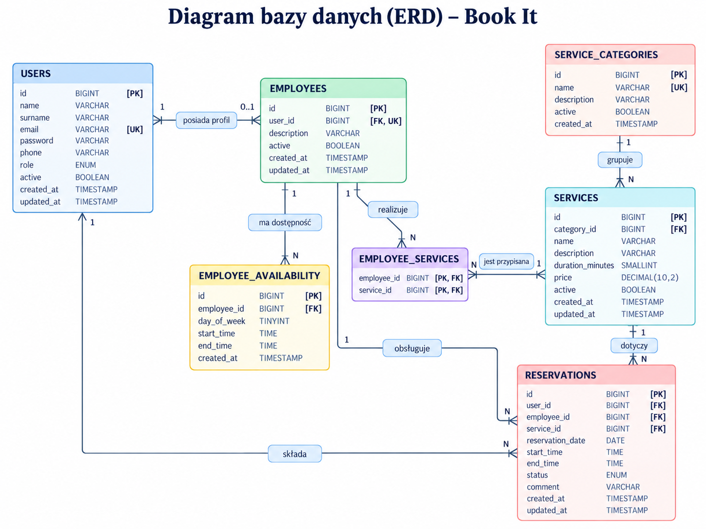

# book.it

book.it to internetowa platforma do rezerwacji usług, która umożliwia klientom znalezienie firmy, sprawdzenie jej oferty oraz zarezerwowanie dostępnego terminu online.

W przeciwieństwie do klasycznego systemu rezerwacji przeznaczonego dla jednej firmy, book.it obsługuje wielu niezależnych usługodawców w ramach jednej aplikacji. Każda firma może posiadać własny profil, ofertę usług, pracowników, godziny dostępności oraz rezerwacje.

Projekt powstaje w ramach przedmiotu **Tworzenie stron i aplikacji internetowych**.

## O projekcie

Celem projektu jest stworzenie uniwersalnego systemu rezerwacji, z którego mogą korzystać różnego rodzaju firmy świadczące usługi, między innymi:

- salony fryzjerskie,
- salony kosmetyczne,
- warsztaty samochodowe,
- serwisy komputerowe,
- studia fotograficzne,
- firmy sprzątające,
- szkoły językowe,
- korepetytorzy,
- trenerzy,
- inni usługodawcy pracujący w oparciu o rezerwacje terminów.

Użytkownik korzysta z jednego konta book.it i za jego pomocą może rezerwować usługi w różnych firmach dostępnych na platformie.

Każda firma posiada własną ofertę i pracowników. Poszczególni pracownicy mogą wykonywać różne usługi oraz posiadać własne godziny pracy i dostępność.

Podstawowy proces rezerwacji wygląda następująco:

```text
Firma -> Usługa -> Pracownik -> Data -> Godzina -> Potwierdzenie
```

System automatycznie wyznacza dostępne terminy na podstawie czasu trwania wybranej usługi, godzin pracy pracownika oraz istniejących rezerwacji.

## Autorzy

- Kacper Księżopolski
- Krystian Kurkus

## Technologie

- PHP
- HTML5
- CSS3
- JavaScript
- MySQL
- GitHub

## Aktualny zakres

Projekt zawiera:

- znormalizowany model relacyjnej bazy danych;
- kompletny skrypt SQL z ograniczeniami integralności i danymi testowymi;
- czytelny diagram bazy danych;
- prostą, responsywną stronę startową.

Logowanie, rejestracja, obsługa ról w aplikacji, panele użytkowników i proces rezerwowania **nie należą do Etapu 1** i nie są jeszcze zaimplementowane.

## Struktura katalogów

```text
.
├── assets/
│   └── diagram_baza.png
├── database/
│   └── database.sql
├── docs/
│   └── ERD.md
├── public/
│   ├── css/
│   │   └── style.css
│   ├── js/
│   │   └── app.js
│   ├── index.html
│   └── index.php
├── .gitignore
└── README.md
```

## Diagram bazy danych



## Uruchomienie

1. Sklonuj repozytorium i przejdź do jego katalogu.
2. Zaimportuj `database/database.sql` do MySQL lub MariaDB. Skrypt utworzy bazę `book_it`, tabele i dane testowe.
3. Uruchom serwer PHP z katalogiem `public` jako katalogiem głównym:

   ```bash
   php -S localhost:8000 -t public
   ```

   Alternatywnie umieść projekt w katalogu obsługiwanym przez XAMPP i skieruj serwer na folder `public`.
4. Otwórz `http://localhost:8000` w przeglądarce.

## Dane testowe

Skrypt SQL dodaje następujące konta demonstracyjne:

| Rola | E-mail |
| --- | --- |
| Administrator | `admin@bookit.test` |
| Klient | `klient@bookit.test` |
| Pracownik | `anna.nowak@bookit.test` |
| Pracownik | `piotr.wisniewski@bookit.test` |

Wartości w kolumnie `password` są przykładowymi hashami, nie hasłami jawnymi. Logowanie zostanie zaimplementowane dopiero w Etapie 2.

## Dokumentacja

- [Diagram i opis relacji](docs/ERD.md)
- [Skrypt tworzący bazę](database/database.sql)
