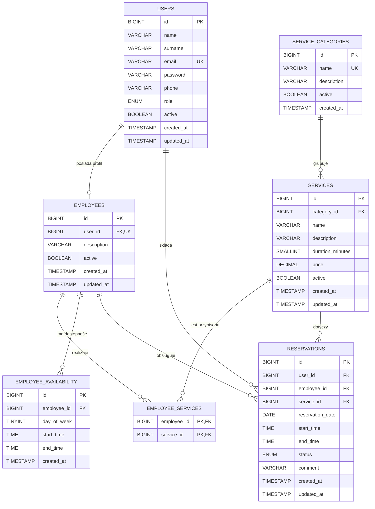

# Diagram ERD

Diagram odpowiada strukturze z pliku `database/database.sql`. Wartości `1`–`7` w `employee_availability.day_of_week` oznaczają dni od poniedziałku do niedzieli.

## Relacje

- `users` 1:0..1 `employees` — jedno konto może mieć najwyżej jeden profil pracownika; zapewnia to `UNIQUE(employees.user_id)`.
- `service_categories` 1:N `services` — usługa należy do jednej kategorii.
- `employees` N:M `services` — relację realizuje tabela łącząca `employee_services` ze złożonym kluczem głównym.
- `employees` 1:N `employee_availability` — pracownik może mieć wiele przedziałów dostępności.
- `users` 1:N `reservations` — użytkownik będący klientem może utworzyć wiele rezerwacji.
- `employees` 1:N `reservations` — pracownik może obsłużyć wiele rezerwacji.
- `services` 1:N `reservations` — usługa może wystąpić w wielu rezerwacjach.
- Złożony klucz obcy `reservations(employee_id, service_id)` gwarantuje, że rezerwacja dotyczy usługi przypisanej danemu pracownikowi.
